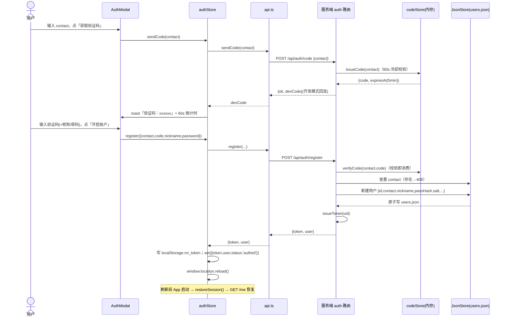
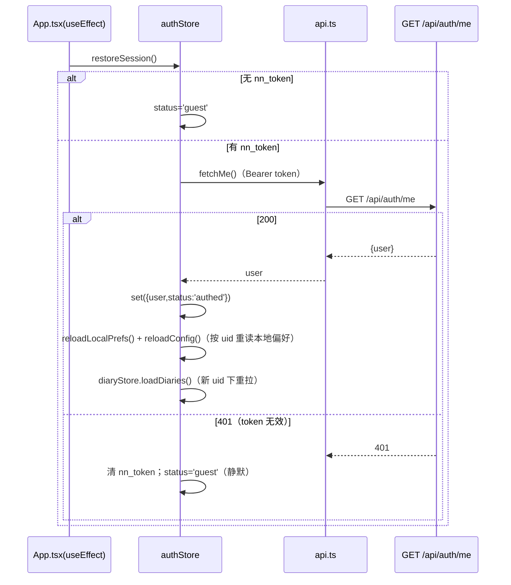
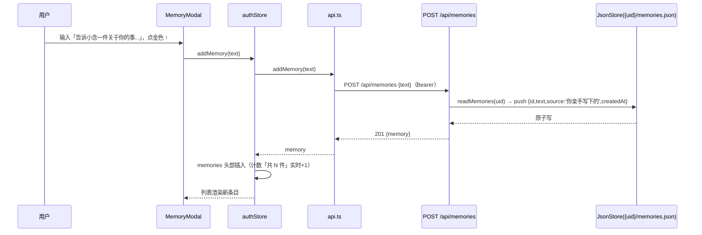
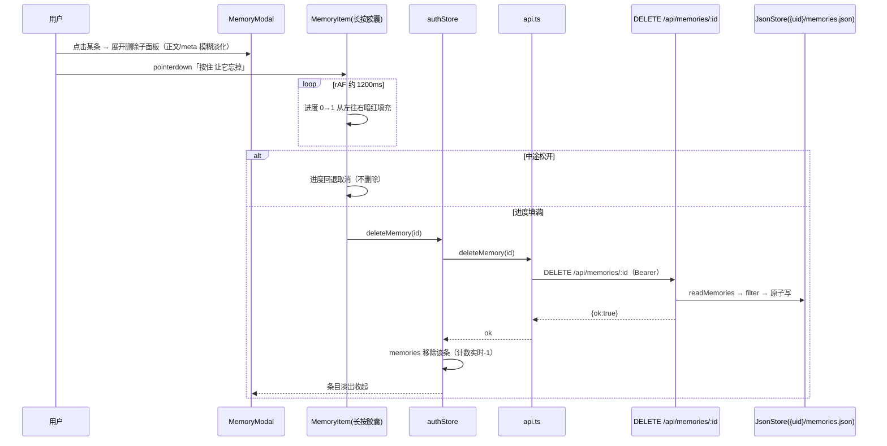
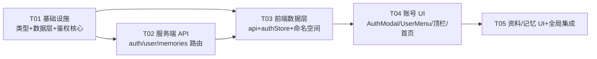

# 粒子日记 — 账号体系迭代：系统设计 + 任务分解

| 项目 | 内容 |
|------|------|
| 文档 | ARCHITECTURE_AUTH.md（本轮迭代 v1.0） |
| 上游 | docs/PRD_AUTH.md（P0-1..15、四.1~4.7、D1/D2/D3、Q1-Q10） |
| 技术栈 | Vite + React + Express；本地存储 IndexedDB / OPFS / localStorage；服务端 server/data/*.json |
| 设计原则 | ① 只做「新增鉴权/用户/记忆接口」+「现有数据读写加 uid 命名空间」两件事；② 保护文件一行不动；③ guest 数据永远留 guest，登录不合并不互通 |

---

## 0. 保护文件清单（红线，零改动）

以下文件/代码段本轮**禁止任何修改**（工程师实现前必须逐项核对）：

| # | 文件 / 代码段 | 说明 |
|---|--------------|------|
| 1 | `src/components/ParticleCanvas.tsx` | 粒子渲染组件（粒子系统 7 文件之一） |
| 2 | `src/hooks/useParticleSystem.ts` | 粒子系统 hook（粒子系统 7 文件之一） |
| 3 | `src/shaders/particleShaders.ts` | 粒子着色器（粒子系统 7 文件之一） |
| 4 | `src/services/imageProcessor.ts` | 图片→粒子数据（粒子系统 7 文件之一） |
| 5 | `src/hooks/useChat.ts` | 聊天流式协调（粒子系统 7 文件之一）——**api.ts 内部加 Bearer 头，不改其调用签名，本文件零改动** |
| 6 | `src/components/ChatPanel.tsx` | 聊天面板（粒子系统 7 文件之一） |
| 7 | `src/components/ChatInput.tsx` | 聊天输入（粒子系统 7 文件之一） |
| 8 | `src/components/EllipseParticles.tsx` | 首页粒子 |
| 9 | `src/components/AmbientBackground.tsx` | 环境背景 |
| 10 | `src/components/RingCursor.tsx` | 圈点光标 |
| 11 | `src/hooks/useAutoHideUI.ts` | 3s 自动隐藏 |
| 12 | `DiaryGallery.tsx` 内 `StackView` / `CorridorView` / `GridView` 函数体（L217 / L479 / L650 起） | 长廊/叠影/网格三视图核心（文件本身**仅允许**在 header 区加 `<AuthEntry />` 挂载点，三视图函数体一字不动） |
| 13 | `ChatMainView.tsx` 内聊天/粒子状态机（phase 状态机、粒子回调、对话逻辑等全部业务逻辑） | 文件本身**仅允许**在顶栏按钮容器（L392 `flex items-center gap-3`）末尾加 `<AuthEntry />` 挂载点 |

另：`ChatMessage.tsx`、`UploadZone.tsx`、`DiaryView.tsx`、`DiaryList.tsx`、`DiaryEditor.tsx`、`DiaryEmptyState.tsx`、`ViewTabs.tsx`、`TextDisplayButtons.tsx`、`CustomCursor.tsx`、`LoadingOverlay.tsx`、`CondenseButton.tsx` 本轮**无需改动**（默认不触碰）。

---

## 1. 实现方案（Implementation Approach）

### 1.1 核心难点与对策

| 难点 | 对策 |
|------|------|
| IndexedDB 按账号隔离，且不能丢现有 guest 数据 | **DB 名 = `particle_diary_${uid}`，guest 沿用旧名 `particle_diary_db`** → 现有 guest 数据零迁移；DB 级隔离天然防串读 |
| OPFS 图片目录隔离 | **目录 = `diary-images-${uid}`，guest 沿用旧名 `diary-images`** → 零迁移 |
| localStorage 3 处模块级缓存（module-init 读取发生在登录态恢复之前） | 统一 `nn_${uid()}_${k}` 命名 + **restoreSession 成功后回调 `reloadLocalPrefs()` / `reloadConfig()` 重读**；登录/注册/登出用 `window.location.reload()` 全页刷新兜底 |
| 服务端无数据库 | `server/data/users.json` + `server/data/{uid}/memories.json`，**原子写（tmp + rename）+ 文件级 promise 链锁** |
| 密码安全 | SHA-256(盐 + 密码)，每用户随机 16B salt，不存明文 |
| token 策略（Q3） | **内存 Map<token, uid> 无状态签名**，随机 32B hex，无过期、无黑名单（登出仅清前端）——最简单且满足开发阶段 |
| 现有业务接口（/api/chat、/api/condense）不被破坏 | 仅挂 `optionalAuth` 中间件（解析 uid，无 token → 'guest'），业务逻辑零改动 |

### 1.2 框架选型

- **不引入任何新的第三方依赖**（全部使用 Node 内置 `node:crypto` / `node:fs` / `node:path` 与现有 express / zustand / idb）。
- 前端状态：zustand 新增 `authStore`；本地存储 helper 新增 `src/utils/uid.ts`。
- 架构模式：**分层**——`utils/uid.ts`（命名空间规则）→ `services/*`（存储/网络）→ `stores/*`（状态）→ `components/*`（视图）；服务端 `middleware → routes → utils(store/security)`。

---

## 2. 文件清单（新增 / 修改）

> 相对项目根目录 `C:\Users\LEGLON\WorkBuddy\念念\particle_diary`。★=新增，✎=修改，🧊=受保护（零改动，仅列出供对照）。

### 2.1 服务端（全部可改，以新增为主）

| 文件 | 类型 | 说明 |
|------|------|------|
| `server/utils/store.ts` | ★ | JSON 原子读写（tmp+rename）、文件锁、users.json / memories.json 存取 helper |
| `server/utils/security.ts` | ★ | 密码哈希（SHA-256 加盐）、tokenStore（内存 Map）、codeStore（内存 Map：5min 有效 + 60s 冷却） |
| `server/middleware/auth.ts` | ★ | `optionalAuth` / `requireAuth` + Express Request 类型增强（req.uid） |
| `server/routes/auth.ts` | ★ | POST /code、POST /register、POST /login、GET /me |
| `server/routes/user.ts` | ★ | PUT /profile、PUT /password |
| `server/routes/memories.ts` | ★ | GET /、POST /、DELETE /:id |
| `server/index.ts` | ✎ | 挂载三个新路由 |
| `server/routes/chat.ts` | ✎ | 仅加 `router.use(optionalAuth)`（一行） |
| `server/routes/condense.ts` | ✎ | 仅加 `router.use(optionalAuth)`（一行） |
| `server/types.ts` | ✎ | 镜像新增 User / Memory / AuthRequest 类型 |
| `server/__tests__/store.test.ts` | ★ | 原子写 / 文件锁 / memories 读写单测 |
| `server/__tests__/security.test.ts` | ★ | 哈希 / token / code 单测 |
| `server/data/.gitkeep` | ★ | 数据目录占位（数据本体 gitignore） |

### 2.2 前端（可改部分）

| 文件 | 类型 | 说明 |
|------|------|------|
| `src/utils/uid.ts` | ★ | `currentUid()`、`nnKey(k)`、`TOKEN_KEY`（共享命名空间 helper） |
| `src/utils/avatar.ts` | ★ | 头像 canvas 256×256 正方形裁切压缩 → base64 data URL |
| `src/stores/authStore.ts` | ★ | 登录态 + 个人资料 + 记忆 + 各弹窗开关 |
| `src/components/AuthModal.tsx` | ★ | 登录/注册弹窗（左右分栏） |
| `src/components/UserMenu.tsx` | ★ | 头像下拉菜单 |
| `src/components/ProfileEditor.tsx` | ★ | 编辑资料层 |
| `src/components/MemoryModal.tsx` | ★ | 长期记忆窗口（含长按删除） |
| `src/components/AuthEntry.tsx` | ★ | 顶栏右上角入口（guest 空心人形 / 登录圆形头像），统一挂载组件 |
| `src/services/api.ts` | ✎ | authFetch + 9 个 auth/user/memory 方法；chat/condense 加 Bearer 头 |
| `src/services/db.ts` | ✎ | 按 uid 区分 DB 名 + 连接缓存 Map |
| `src/services/imageStore.ts` | ✎ | 按 uid 区分 OPFS 目录 + 缓存 Map |
| `src/services/migrate.ts` | ✎ | `migrateDiary(diary, uid)` 透传 uid |
| `src/stores/diaryStore.ts` | ✎ | 所有 db/imageStore 调用透传 `currentUid()` |
| `src/stores/appStore.ts` | ✎ | textDisplayMode key → `nnKey('textDisplayMode')`；新增 `reloadLocalPrefs()` |
| `src/utils/constants.ts` | ✎ | CONFIG key → `nnKey(...)`；新增 `reloadConfig()`；`saveConfig/clearConfig` 运行时取 uid |
| `src/components/AtmospherePanel.tsx` | ✎ | quality key → `nnKey('particleQuality')`（仅 key 命名空间化，逻辑不动） |
| `src/components/Logo.tsx` | ✎ | 「{昵称} 的念念」/「念念」动态化 |
| `src/components/LandingPage.tsx` | ✎ | 未登录双按钮 + 顶中胶囊「移动端小程序开发中~」（当前代码无此胶囊，见 §6.1） |
| `src/components/ChatMainView.tsx` | ✎ | **仅**顶栏按钮容器末尾加 `<AuthEntry />`（L392 容器内） |
| `src/components/DiaryGallery.tsx` | ✎ | **仅** header 顶部行右侧按钮组末尾加 `<AuthEntry />`（L857 容器内） |
| `src/components/ToastContainer.tsx` | ✎ | z-index 50 → 110（保证 toast 显示在弹窗之上） |
| `src/App.tsx` | ✎ | 启动 `restoreSession()` + 全局挂载 AuthModal/ProfileEditor/MemoryModal |
| `src/utils/helpers.ts` | ✎ | 新增 `formatDotDateTime(ts)`（记忆 meta 用） |
| `src/types/index.ts` | ✎ | 新增 User / Memory / Auth 请求响应类型 |
| `.gitignore` | ✎ | 追加 `server/data/` |
| `vitest.config.ts` | ✎ | include 扩展 `server/**/*.test.ts`（服务端测试文件加 `@vitest-environment node`） |
| `src/services/__tests__/db.test.ts` | ✎ | 补充 uid 隔离用例 |
| `src/stores/__tests__/appStore.test.ts` | ✎ | 适配 key 命名空间 |
| `src/services/__tests__/apiAuth.test.ts` | ★ | authFetch / 带 token 请求头单测（mock fetch） |
| `src/utils/__tests__/uid.test.ts` | ★ | nnKey / currentUid 单测 |
| `src/stores/__tests__/authStore.test.ts` | ★ | authStore 动作单测（mock api） |

### 2.3 受保护文件（🧊，仅供对照，零改动）

`src/components/ParticleCanvas.tsx`、`src/hooks/useParticleSystem.ts`、`src/shaders/particleShaders.ts`、`src/services/imageProcessor.ts`、`src/hooks/useChat.ts`、`src/components/ChatPanel.tsx`、`src/components/ChatInput.tsx`、`src/components/EllipseParticles.tsx`、`src/components/AmbientBackground.tsx`、`src/components/RingCursor.tsx`、`src/hooks/useAutoHideUI.ts`，以及 `DiaryGallery.tsx` 的 StackView/CorridorView/GridView 函数体、`ChatMainView.tsx` 的聊天/粒子状态机逻辑。

---

## 3. 数据结构与接口（Data Structures & Interfaces）

### 3.1 核心设计决策（8 问必答）

**D1. IndexedDB 按 uid 隔离（选 A 变体：DB 名隔离 + guest 沿用旧名）**
- 规则：`dbNameFor(uid) = uid === 'guest' ? 'particle_diary_db' : 'particle_diary_${uid}'`。
- 理由：DB 级隔离不可能因漏写过滤条件而串读；guest 沿用旧名 → 现有 guest 数据零迁移。
- 改造：`getDB(uid = 'guest')`；`dbPromises = new Map<string, Promise<IDBPDatabase>>()`（按 DB 名缓存连接）；四个导出函数均加可选 `uid` 参数（默认 'guest'）。
- 调用方：仅 `diaryStore.ts`（保持唯一导入 db.ts 的模块），内部传 `currentUid()`。

**D2. OPFS 目录隔离**
- 规则：`dirNameFor(uid) = uid === 'guest' ? 'diary-images' : 'diary-images-${uid}'`；`dirPromises = new Map<uid, Promise<handle|null>>()`。
- 三个导出函数 `saveOriginalImage / getOriginalImage / deleteOriginalImage` 加可选 `uid` 参数；`migrate.ts` 内 `saveOriginalImage` 调用同步透传（`migrateDiary(diary, uid)`）。

**D3. localStorage 命名空间**
- 共享 helper（`src/utils/uid.ts`）：
  ```ts
  import { useAuthStore } from '../stores/authStore';
  export const TOKEN_KEY = 'nn_token';                       // 全局，不命名空间
  export function currentUid(): string { return useAuthStore.getState().user?.id ?? 'guest'; }
  export function nnKey(k: string): string { return `nn_${currentUid()}_${k}`; }
  ```
- 调用点：① appStore `textDisplayMode` → `nnKey('textDisplayMode')`；② constants CONFIG → `nnKey('particle_atmosphere_config_v2')`；③ AtmospherePanel quality → `nnKey('particleQuality')`。
- **关键坑**：模块级读取发生在登录态恢复前（读到 guest 值）→ authStore.restoreSession 成功后回调 `useAppStore.getState().reloadLocalPrefs()` 与 `reloadConfig()` 重读当前 uid 的值；登录/注册/登出 `window.location.reload()` 兜底全量刷新。

**D4. 服务端鉴权**
- `users.json`：`[{ id, contact, nickname, passHash, salt, avatar, createdAt }]`；`passHash = SHA-256(salt + password)` hex；salt 为 `crypto.randomBytes(16).toString('hex')`。
- 验证码：内存 `Map<contact, { code, expiresAt, cooldownUntil }>`；5 分钟有效、60s 发送冷却（429 + retryAfterSec）；开发模式响应含 `devCode` + 控制台打印；**校验即消费**（一次性）。
- token：`Map<token, uid>`，`token = crypto.randomBytes(32).toString('hex')`；无过期、无黑名单（Q3 采纳）；登出仅清前端。
- 中间件：`optionalAuth`（有合法 Bearer → `req.uid=uid`；无 token → `req.uid='guest'`；有但非法 → 401 `{error:'invalid_token'}`）；`requireAuth`（guest → 401）。
- 文件读写：`server/utils/store.ts`，原子写 `writeFile(tmp) → rename`，文件级 promise 链锁防并发覆盖。

**D5. 记忆接口**（RESTful，guest 允许，落 `server/data/{uid}/memories.json`）
- `GET /api/memories` → `{ memories }`（按 createdAt 降序）；`POST /api/memories` `{text}` → `201 { memory }`；`DELETE /api/memories/:id` → `{ ok:true }`（不存在 404）。
- 记录：`{ id, text, source: '你亲手写下的', createdAt }`。

**D6. 4 个新组件结构**（见 3.3）

**D7. authStore**（见 3.3；登录/注册/登出 = `window.location.reload()` 最简可靠；资料编辑 = 实时同步不刷新）

**D8. api.ts 扩展**：新增 `authFetch`（自动附加 Bearer）；`chat()/condense()` 也附加 Bearer（P0-6 一致性，服务端已挂 optionalAuth，行为不变）。

### 3.2 类图（Mermaid classDiagram）

```mermaid
classDiagram
    class User {
        +string id
        +string contact
        +string nickname
        +string? avatar
        +number createdAt
    }
    class Memory {
        +string id
        +string text
        +string source
        +number createdAt
    }
    class AuthApi {
        +sendCode(contact) Promise~void~
        +register(input) Promise~AuthResponse~
        +login(input) Promise~AuthResponse~
        +fetchMe() Promise~User~
        +updateProfile(patch) Promise~User~
        +updatePassword(password) Promise~void~
        +fetchMemories() Promise~Memory[]~
        +addMemory(text) Promise~Memory~
        +deleteMemory(id) Promise~void~
    }
    class AuthStore {
        +string? token
        +User? user
        +AuthStatus status
        +boolean authModalOpen
        +boolean profileOpen
        +boolean memoryOpen
        +Memory[] memories
        +sendCode(contact) Promise~void~
        +register(input) Promise~void~
        +login(input) Promise~void~
        +logout() void
        +restoreSession() Promise~void~
        +updateProfile(patch) Promise~void~
        +updatePassword(password) Promise~void~
        +loadMemories() Promise~void~
        +addMemory(text) Promise~void~
        +deleteMemory(id) Promise~void~
    }
    class UidHelper {
        +currentUid() string
        +nnKey(k) string
        +TOKEN_KEY string
    }
    class DiaryDb {
        +saveDiary(diary, uid?) Promise~void~
        +getDiary(id, uid?) Promise~Diary|null~
        +getAllDiaries(uid?) Promise~Diary[]~
        +deleteDiary(id, uid?) Promise~void~
    }
    class ImageStore {
        +saveOriginalImage(id, blob, uid?) Promise~string|null~
        +getOriginalImage(diary, uid?) Promise~Blob|null~
        +deleteOriginalImage(diary, uid?) Promise~void~
    }
    class DiaryStore {
        +Diary[] diaryList
        +loadDiaries() Promise~void~
        +saveDiary(diary, originalBlob?) Promise~void~
        +deleteDiary(id) Promise~void~
    }
    class AuthModal { +open +onClose }
    class UserMenu { +user }
    class ProfileEditor { +open +onClose }
    class MemoryModal { +open +onClose }
    class AuthEntry { +user }

    AuthStore --> AuthApi : 调用
    AuthStore --> UidHelper : 依赖
    DiaryStore --> DiaryDb : 唯一调用方
    DiaryStore --> ImageStore
    DiaryStore --> UidHelper
    AuthModal ..> AuthStore : 读写
    UserMenu ..> AuthStore : 读写
    ProfileEditor ..> AuthStore : 读写
    MemoryModal ..> AuthStore : 读写
    AuthEntry ..> AuthStore : 读写

    class JsonStore {
        +readJson(path) Promise~T|null~
        +writeJsonAtomic(path, data) Promise~void~
        +withFileLock(key, fn) Promise~T~
        +getUsers() Promise~User[]~
        +saveUser(user) Promise~void~
        +readMemories(uid) Promise~Memory[]~
        +saveMemories(uid, list) Promise~void~
    }
    class Security {
        +hashPassword(password) {salt, hash}
        +verifyPassword(password, salt, hash) boolean
        +issueToken(uid) string
        +resolveToken(token) string|undefined
        +issueCode(contact) string
        +verifyCode(contact, code) boolean
    }
    class OptionalAuth { +handle(req,res,next) }
    class AuthRouter { +post_code +post_register +post_login +get_me }
    class UserRouter { +put_profile +put_password }
    class MemoriesRouter { +get_list +post_create +delete_one }

    AuthRouter --> JsonStore
    AuthRouter --> Security
    UserRouter --> JsonStore
    UserRouter --> Security
    MemoriesRouter --> JsonStore
    MemoriesRouter --> OptionalAuth
```

### 3.3 组件结构与 z-index 规划

| 组件 | props/store 依赖 | DOM 层级 | z-index |
|------|------------------|----------|---------|
| `AuthModal` | 读 `authStore.authModalOpen`，写 `setAuthModalOpen`；用 `sendCode/register/login` | `createPortal(document.body)`，居中固定大卡片 | 100 |
| `UserMenu` | 读 `authStore.user`；`setProfileOpen` / `setMemoryOpen` / `logout` | `createPortal(document.body)`，定位由触发按钮 `getBoundingClientRect()` 计算 | 70 |
| `ProfileEditor` | 读 `profileOpen`；`updateProfile` / `updatePassword`；`utils/avatar.ts` | `createPortal(document.body)`，全屏 overlay | 80 |
| `MemoryModal` | 读 `memoryOpen`、`memories`；`loadMemories/addMemory/deleteMemory` | `createPortal(document.body)`，居中竖长卡片 | 90 |
| `AuthEntry` | 读 `authStore.user`；guest→空心人形（点开 AuthModal）；登录→圆形头像（点开 UserMenu） | 就地渲染于 ChatMainView 顶栏 / DiaryGallery header | 跟随宿主（30 / header 内） |

Toast 提升至 **z-110**（ToastContainer 修改，非保护文件），保证验证码 toast 覆盖在 AuthModal 之上。

### 3.4 authStore 设计（含登录态刷新策略）

```ts
type AuthStatus = 'boot' | 'guest' | 'authed';
interface AuthState {
  token: string | null; user: User | null; status: AuthStatus;
  authModalOpen: boolean; profileOpen: boolean; memoryOpen: boolean;
  memories: Memory[]; memoriesLoading: boolean;
  sendCode(contact): Promise<void>;
  register(input: { contact; code; nickname?; password? }): Promise<void>;
  login(input: { contact; password?; code? }): Promise<void>;
  logout(): void;
  restoreSession(): Promise<void>;
  updateProfile(patch: { nickname?; avatar? }): Promise<void>;
  updatePassword(password): Promise<void>;
  loadMemories(): Promise<void>;
  addMemory(text): Promise<void>;
  deleteMemory(id): Promise<void>;
}
```

**登录态切换刷新策略（决策）**：
- **登录 / 注册 / 登出 → `window.location.reload()`**（最简可靠）。理由：localStorage 3 处 key 与 CONFIG 等模块级缓存需在正确 uid 下重读；IndexedDB/OPFS 连接需按新 uid 重建；PRD P0-11 明确「全页刷新为 guest 数据」。
- **资料编辑（昵称/头像/密码）→ 实时同步，不刷新**：`updateProfile` 成功后 `set({ user })`，顶栏/Logo 自动重渲染。
- **页面加载恢复登录态 → 不刷新**：`restoreSession()` 成功后回调 `reloadLocalPrefs()` / `reloadConfig()` 重读当前 uid 的本地偏好，并触发 `useDiaryStore.getState().loadDiaries()`（此时列表为空，无副作用）。
- 无效 token（/me 401）→ 静默清 `nn_token` 回 guest（Q9 采纳）。

---

## 4. 关键时序（Sequence Diagrams）

### 4.1 注册 / 登录（含验证码）



### 4.2 登录态恢复（App 启动）



### 4.3 新增一条长期记忆



### 4.4 长按删除记忆



---

## 5. 任务分解（Task List，按依赖排序，≤5 个）

### T01 — 基础设施：共享类型 + 服务端数据层 + 鉴权核心（P0）

- **源文件**：`src/types/index.ts` ✎、`server/types.ts` ✎、`server/utils/store.ts` ★、`server/utils/security.ts` ★、`server/middleware/auth.ts` ★、`server/__tests__/store.test.ts` ★、`server/__tests__/security.test.ts` ★、`server/data/.gitkeep` ★、`.gitignore` ✎、`vitest.config.ts` ✎
- **依赖**：无（首个任务）
- **优先级**：P0
- **验收**：`npm test` 通过（新增 store/security 单测）；users.json 原子写与文件锁可用；hash/verify/token/code 行为正确。

### T02 — 服务端 API：auth / user / memories 路由 + 挂载 + 现有路由加 optionalAuth（P0）

- **源文件**：`server/routes/auth.ts` ★、`server/routes/user.ts` ★、`server/routes/memories.ts` ★、`server/index.ts` ✎、`server/routes/chat.ts` ✎（仅一行 middleware）、`server/routes/condense.ts` ✎（仅一行 middleware）
- **依赖**：T01
- **优先级**：P0
- **验收**：curl 验证 code/register/login/me/profile/password/memories 全部接口；无 token 时 memories 读写 guest；chat/condense 行为不变。

### T03 — 前端数据层：api 扩展 + authStore + uid 命名空间 + 本地存储隔离（P0）

- **源文件**：`src/utils/uid.ts` ★、`src/services/api.ts` ✎、`src/stores/authStore.ts` ★、`src/services/db.ts` ✎、`src/services/imageStore.ts` ✎、`src/services/migrate.ts` ✎、`src/stores/diaryStore.ts` ✎、`src/stores/appStore.ts` ✎、`src/utils/constants.ts` ✎、`src/components/AtmospherePanel.tsx` ✎（仅 key）、`src/services/__tests__/db.test.ts` ✎、`src/stores/__tests__/appStore.test.ts` ✎、`src/services/__tests__/apiAuth.test.ts` ★、`src/utils/__tests__/uid.test.ts` ★、`src/stores/__tests__/authStore.test.ts` ★
- **依赖**：T01、T02（接口契约）
- **优先级**：P0
- **验收**：db/imageStore 按 uid 隔离且 guest 走旧名（现有数据可见）；3 处 localStorage key 变为 `nn_{uid}_*`；authStore 动作 + mock 单测通过；chat/condense 请求带 Bearer 头且 useChat.ts 零改动。

### T04 — 账号 UI：登录/注册弹窗 + 顶栏入口 + 首页/Logo 集成（P0）

- **源文件**：`src/components/AuthModal.tsx` ★、`src/components/UserMenu.tsx` ★、`src/components/AuthEntry.tsx` ★、`src/utils/avatar.ts` ★、`src/components/Logo.tsx` ✎、`src/components/LandingPage.tsx` ✎、`src/components/ChatMainView.tsx` ✎（仅顶栏挂载点）、`src/components/DiaryGallery.tsx` ✎（仅 header 挂载点）
- **依赖**：T03
- **优先级**：P0
- **验收**：未登录 Landing 双按钮（从一张照片开始 / 登录已有账号）与顶中胶囊；顶栏 guest 空心人形 → AuthModal；登录后顶栏头像 → UserMenu（编辑资料/长期记忆/登出）；Logo 动态昵称；ChatMainView/DiaryGallery 保护逻辑零改动（diff 仅限挂载点）。

### T05 — 资料/记忆 UI + 全局集成（P0）

- **源文件**：`src/components/ProfileEditor.tsx` ★、`src/components/MemoryModal.tsx` ★、`src/App.tsx` ✎、`src/components/ToastContainer.tsx` ✎、`src/utils/helpers.ts` ✎
- **依赖**：T04
- **优先级**：P0
- **验收**：编辑资料层（头像 256px canvas 压缩即时生效、昵称行内编辑、改密 toast）；长期记忆窗口（列表/新增/长按 1.2s 删除/计数实时）；App 启动 restoreSession + 三弹窗全局挂载；登出回 guest 全页刷新；P0-1..15 全量自测通过。

### 任务依赖图



---

## 6. 共享知识（跨文件约定）

- **localStorage key 规则**：全局 `nn_token`（token）；命名空间 `nn_${uid()}_textDisplayMode`、`nn_${uid()}_particle_atmosphere_config_v2`、`nn_${uid()}_particleQuality`；`uid() = currentUser?.id ?? 'guest'`。
- **uid 命名空间**：IndexedDB DB 名 `particle_diary_${uid}`（guest → `particle_diary_db`）；OPFS 目录 `diary-images-${uid}`（guest → `diary-images`）；服务端数据 `server/data/${uid}/memories.json`；`users.json` 为全局账号索引。
- **服务端响应**：错误统一 `{ error: string, message?: string }`；成功按端点：auth `{ token, user }`、me `{ user }`、profile `{ user }`、password `{ ok:true }`、memories `{ memories }`、create memory `201 { memory }`、delete `{ ok:true }`。
- **HTTP 状态码**：400 参数非法；401 凭证/token 非法（`invalid_token`）；404 资源不存在；409 contact 已注册；429 验证码冷却（带 `retryAfterSec`）；500 服务端异常。
- **密码规范**：`passHash = SHA-256(salt + password)` hex；salt `randomBytes(16).toString('hex')`；注册密码选填（若填 ≥6 位）。
- **验证码规范**：6 位数字；5 分钟有效；60s 冷却；校验即消费；开发模式（`NODE_ENV !== 'production'`）响应体带 `devCode` 并 console.log。
- **token 规范**：`randomBytes(32).toString('hex')`；服务端内存 Map 无过期；前端存 `nn_token`；登出仅清前端。
- **头像规范**：base64 data URL，`data:image/(png|jpeg|webp);base64,...`，总长 ≤ 200KB，canvas 256×256 正方形裁切；服务端超限 400。
- **记忆规范**：`{ id, text, source: '你亲手写下的', createdAt }`；text 非空且 ≤500 字；guest 也允许（D2，匿名访客共享 guest 空间，产品已确认接受）。
- **服务端 ESM**：import 一律带 `.js` 后缀（如 `import { optionalAuth } from '../middleware/auth.js'`）。
- **服务端数据写**：一律走 `store.ts` 原子写（tmp + rename）+ `withFileLock`，禁止直接 `fs.writeFile` 覆盖。
- **测试**：vitest include 扩展 `server/**/*.test.ts`，服务端测试文件首行 `// @vitest-environment node`。
- **组件层级**：AuthModal z-100 / MemoryModal z-90 / ProfileEditor z-80 / UserMenu z-70 / Toast z-110；弹窗一律 `createPortal(document.body)`。

---

## 7. 待明确事项（Assumptions & Open Points）

1. **「移动端小程序开发中~」胶囊当前不存在**（已 grep 全库确认）。PRD 写「保留」，本设计按「新增到 LandingPage 顶中」处理（fixed top-6 居中，小号胶囊，guest/登录均显示）。若原意是别的位置，需产品确认。
2. **Logo 未登录显示「念念」**：现代码硬编码「小董 的念念」→ 改为 `user ? '${nickname} 的念念' : '念念'`（guest 不再显示「小董」）。
3. **注册昵称默认值**：昵称选填，为空时服务端默认 `'念念的朋友'`（PRD 未定，此为假设，可改为掩码 contact）。
4. **chat/condense 的 uid 本轮不用于业务逻辑**（P2-2 记忆注入才用），仅挂 optionalAuth 满足 P0-6 命名空间层。
5. **服务端路由测试不引入 supertest 等新依赖**：T01 覆盖 store/security 单测；接口级验证由 QA 以 curl/手工完成（如需自动化可后续加依赖）。
6. **登录后数据刷新**：采用 `window.location.reload()`；若后续要求「免刷新丝滑切换」，再升级为 authStore 事件驱动全量重拉（本轮不做）。
7. **guest 记忆共享**：所有未登录访客共享 `server/data/guest/memories.json`（D2 已确认接受；上线前如需改为本地存储需产品决策）。
